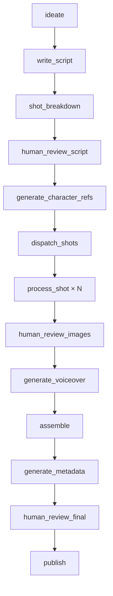

# Perspective Engine

Two products live in this repo. They do not share a pipeline.

**Production YouTube documentaries** are the `channel/` engine: still-first 2D animated cuts for three named channels, assembled locally with Cursor GenerateImage, Kokoro, and FFmpeg.

**LangGraph (`graph/`)** is a separate Phase-1 skeleton for a different, still-local prototype. It is **not** how named-person YouTube titles are made. A title that names a real person belongs on `python -m channel generate`, never `python -m graph run`.

Working contract for any agent with empty chat history: [`AGENTS.md`](AGENTS.md). Channel playbooks: [`docs/custom-videos.md`](docs/custom-videos.md), [`docs/behind-the-business.md`](docs/behind-the-business.md), [`docs/how-they-took-over.md`](docs/how-they-took-over.md). Engine specs: [`docs/video-engine/`](docs/video-engine/).

## Production: documentary channels

| Public name | `--channel` |
|---|---|
| What They Really Think | `what_they_really_think` |
| How They Really Make Money | `behind_the_business` (alias `how_they_really_make_money`) |
| How They Took Over | `how_they_took_over` |

Pass `--channel` explicitly. Do not infer it from the title. Do not mix story or visual grammars.

Canonical command:

```text
.venv/bin/python -m channel generate --channel what_they_really_think --title "What Einstein Really Thought About God"
.venv/bin/python -m channel generate --channel behind_the_business --title "How Visa Really Makes Money"
.venv/bin/python -m channel generate --channel how_they_took_over --title "How Nvidia Took Over AI"
```

Jobs live under `artifacts/<JOB_ID>/`. Sequential local init (`python -m channel init`) still writes `channel/projects/<slug>/`; Cloud Agents should use `generate` so jobs do not collide.

When the operator already has timestamped stills (`[00-00]_….jpg`) and narration audio, `python -m channel drop --channel <mode> --title "…"` writes a drop folder. Assemble Lanczos-upscales to 4K and muxes the VO without burned captions.

```text
DO NOT MODIFY THE VIDEO ENGINE, CHANNEL PROMPTS, GLOBAL STYLE, MODEL CONFIGURATION, OR QA THRESHOLDS DURING A NORMAL VIDEO GENERATION TASK.
```

Sacred for every video: fresh research; a different story architecture; original narration (not rewritten articles or YouTube transcripts); unique scenes and diagrams; a unique story engine. `the_thought` must be spoken. Brand consistency is not a name-swap spine. `originality_score` vs the last 10 videos on the **same** channel must be ≥ 80 and `ready_to_publish` before GenerateImage.

Long cuts are **~5–15 minutes** (**800–2500** words). Voice is **imported audio** on new jobs (operator ElevenLabs or any TTS; the engine never calls those APIs). Shipped recuts may still use Kokoro (`am_liam` or roster `am_michael` / `am_fenrir`). Images are operator **Google Flow** stills from `flow_prompts.txt` only after QA. Named public figures are a recognizable cartoon of the real person; reuse `channel/character_locks.json` and the hashed photo plus sheet in `channel/character_sheets/` as Flow references. Match the **grammar** in [`docs/video-engine/QUALITY_BAR.md`](docs/video-engine/QUALITY_BAR.md) without cloning a reference-cut spine. Historical names and company names stay out of image prompts and still filenames.

After compile, GenerateImage the 16:9 and 9:16 thumbnail jobs (no on-image text) and run `python -m channel youtube <slug>`. YouTube descriptions include an honest synthetic-media disclosure. Different titles wait 24 hours between assembles.

Paste-ready Cloud prompt: [`docs/video-engine/CLOUD_AGENT_START_PROMPT.md`](docs/video-engine/CLOUD_AGENT_START_PROMPT.md). Quality-bar prompt: [`docs/video-engine/QUALITY_BAR_START_PROMPT.md`](docs/video-engine/QUALITY_BAR_START_PROMPT.md).

### Documentary install and smoke

Python ≥ 3.13, `ffmpeg` on `PATH` for assemble. Documentary generation does **not** need `FAL_KEY` or `ELEVENLABS_API_KEY`. If Kokoro or GenerateImage is missing, stop.

```text
python3.13 -m venv .venv
source .venv/bin/activate
pip install -e ".[dev]"
.venv/bin/python -m channel cloud-readiness
.venv/bin/python -m channel qa <job_id-or-slug>
```

Shipped cuts live in `fixtures/` plus a page under `docs/videos/`, `docs/business/`, or `docs/takeover/`. Do not commit `.mp4` files. Parallel Cloud jobs must not clobber repo-root `fixtures/`.

## LangGraph prototype (not YouTube titles)

Local-first skeleton: typed LangGraph, still-first shots, three human-review interrupts, synthetic-content disclosure, and a 24-hour publish-cadence cap. `ideate` **rejects** real named people as video subjects. Adapters are disposable; durable code lives in `graph/`.

```text
python -m graph mock-run --topic "The History of Paperclips"
python -m graph run --topic "The History of Paperclips"
python -m graph resume --thread-id <id>
```

Copy `.env.example` to `.env` only if you are exercising the graph adapters (Anthropic, fal.ai, ElevenLabs). That path is independent of documentary production.

## Workflow

LangGraph prototype only. Documentary jobs follow [`docs/video-engine/PIPELINE.md`](docs/video-engine/PIPELINE.md).



## Character consistency

On `graph/`, identity is a reference sheet plus still-before-video, not a prompt. Details: [`docs/architecture.md`](docs/architecture.md#character-consistency-in-depth). Documentary titles use `channel/character_locks.json` and hashed sheets in `channel/character_sheets/` as GenerateImage references.

## Roadmap

LangGraph phases live in [`docs/roadmap.md`](docs/roadmap.md). Documentary shipping is ongoing on `channel/` and is not gated on those phases.

## Implemented today

### Documentary engine (`channel/`)

Covered by `tests/test_channel_handoff.py`, `tests/test_behind_the_business.py`, `tests/test_how_they_took_over.py`, `tests/test_character_locks.py`, `tests/test_quality_bar.py`, and the rest of the `channel/` suite.

- Isolated jobs under `artifacts/<JOB_ID>/` with resume via `--resume`.
- Three frozen visual styles in `channel/config.py`; mode aliases in `channel/modes.py`.
- Prompt modules: `channel/agent_prompts.py`, `channel/business_prompts.py`, `channel/takeover_prompts.py`.
- Compile writes fixture + stills + spec + hashed image jobs + thumbs + draft YouTube copy.
- QA: fact check, story lints, originality ≥ 80, `ready_to_publish` before GenerateImage.
- Public-figure cartoon locks: `channel/character_locks.json` + hashed sheets.
- Quality-bar grammar (kid map, oversized focal object, unique cinema stills, punchy Short): `channel/quality_bar.py`.
- Kokoro-only voice; Costco lock 0.92; new titles 1.0–1.15 (default 1.15).
- Shorts end on “Watch the full video. The link is in the description.”
- YouTube pack: description, tags, 1280×720 and 1080×1920 JPEGs, synthetic-media disclosure.

### LangGraph skeleton (`graph/`)

Covered by the `graph/` tests. Full node graph with fan-out, in-node retries, three non-bypassable interrupts, still-before-video, no-real-person at `ideate`, disclosure invariant, 24-hour cadence, cost logging, FastAPI review UI, mock CLI.

`pytest` currently collects **322** tests across both products.

## Layout

```text
channel/           documentary engine (production YouTube)
  config.py        channel styles, voice, length locks
  engine.py        versions, model lock, render lock
  generate.py      isolated job entry (`python -m channel generate`)
  compile.py       fixtures, specs, hashed image jobs, YouTube draft
  character_locks.json + character_sheets/   public-figure cartoons
  quality_bar.py   grammar of the best-performing uploads
docs/video-engine/ pipeline, visual style, originality, Cloud prompts
docs/videos/       shipped What They Really Think pages
docs/business/     shipped How They Really Make Money pages
docs/takeover/     shipped How They Took Over pages
fixtures/          shipped compile output (not parallel Cloud jobs)
artifacts/         per-job working trees (gitignored)
jobs/              optional job JSON for `generate --job`
graph/             LangGraph prototype (not documentary titles)
  adapters/        disposable provider wrappers
  nodes/           one module per pipeline stage
assets/            local stills, audio, assembled mp4 (gitignored)
scripts/           assemble, lints, Cloud helpers
tests/
```

## Further reading

- [AGENTS.md](AGENTS.md) — working contract for every agent
- [Custom videos](docs/custom-videos.md) — What They Really Think playbook
- [Behind the business](docs/behind-the-business.md) — How They Really Make Money
- [How they took over](docs/how-they-took-over.md)
- [Video engine](docs/video-engine/README.md)
- [Quality bar](docs/video-engine/QUALITY_BAR.md)
- [Architecture](docs/architecture.md) — LangGraph deep dive
- [Decisions](docs/decisions/)
- [Roadmap](docs/roadmap.md) — LangGraph phases (documentary shipping is `channel/`)
- [Prompts index](prompts/README.md)
