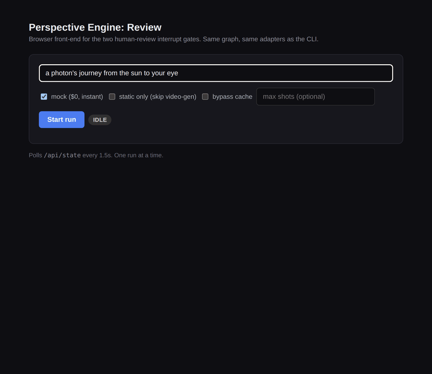
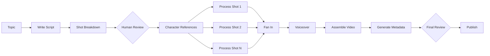

# Perspective Engine

[](https://github.com/itsleeevi/perspective-engine/actions/workflows/ci.yml)

A stateful AI video orchestration pipeline built with LangGraph.

Perspective Engine turns a topic (for example, "a photon's journey from the sun to your eye" or "a day in the life of a bee") into a narrated video through script generation, human approval, character-reference creation, parallel per-shot generation, automated quality checks, bounded retries, voice generation, and final video assembly.

> **Current status: local prototype.** The complete workflow runs end-to-end with mock adapters ($0, no API calls) and also supports real OpenAI, Anthropic, fal.ai, Pollinations, Edge TTS, and ElevenLabs integrations. Video assembly runs on local FFmpeg. Durable cloud infrastructure, a full review dashboard, and Remotion rendering are planned. See [Roadmap](#roadmap).

## Highlights

- Stateful LangGraph workflow with checkpointed, resumable execution
- Two non-bypassable human-approval gates (script and final review)
- Parallel per-shot generation via LangGraph `Send` fan-out with a fixed-edge fan-in barrier
- Character-reference workflow that derives every shot from a locked identity sheet, never from a text prompt alone
- Per-shot quality gate with capped retries that escalate to human review instead of looping forever
- Provider-independent adapters for LLM, image, video, and voice generation
- Mock mode for deterministic, free development and testing
- Real MP4 assembly with FFmpeg (downloads assets, freezes stills into segments, concatenates, mixes narration)
- Script fixtures (`graph/script_fixture.py`) that let a reviewed JSON script skip the LLM entirely, plus locally rendered `[TITLE]` cards (`graph/title_cards.py`) for level/rank transitions — no image-model call for title beats
- 148 automated tests covering control flow, invariants, and state, run on every push via GitHub Actions

## Demo

Recorded against the browser review UI in mock mode: no API calls, no cost.



## Quick Start

Requires Python 3.13+ and `ffmpeg` on `PATH`.

```bash
git clone https://github.com/itsleeevi/perspective-engine.git
cd perspective-engine

python -m venv .venv
source .venv/bin/activate

pip install -e ".[dev]"

python -m cli.run --mock "a photon's journey from the sun to your eye"
```

Mock mode runs the complete workflow (script, review gates, parallel shot generation, quality gates, assembly) without any API calls or provider cost, approving both gates from the terminal.

Prefer a browser? The same graph and adapters are also exposed through a lightweight review UI:

```bash
python -m webui.server
# open http://localhost:8765
```

Run the test suite:

```bash
pytest tests/ -v
```

## Workflow



Each shot is processed independently: derive a still anchored to the character reference sheet, generate or animate the shot, check quality and identity, retry failures up to a fixed cap, and escalate repeated failures for human review. `process_shot` is dispatched once per shot via LangGraph's `Send` primitive; a fixed (non-conditional) edge back to `generate_voiceover` acts as the fan-in barrier, so voiceover generation only starts once every shot has finished, regardless of completion order.

For the full node list, state schema, and the reasoning behind the fan-out/fan-in and still-first design, see [`docs/architecture.md`](docs/architecture.md).

## Implemented Today

| Area          | Current implementation                                                                       |
| ------------- | -------------------------------------------------------------------------------------------- |
| Orchestration | LangGraph state graph (fan-out/fan-in, conditional routing, interrupts)                      |
| State         | Typed Pydantic models (`graph/state.py`), single source of truth threaded through every node |
| Checkpointing | In-memory (tests) and local SQLite (`graph/checkpointer.py`)                                 |
| LLM           | OpenAI (script + storyboard authoring) and Anthropic Claude Haiku (per-shot vision quality check), plus mock adapters |
| Image         | OpenAI `gpt-image-*` (default stills, chosen for reliable in-scene text), fal.ai FLUX.1 [dev]/[schnell], free Pollinations, and mock adapters |
| Video         | fal.ai Seedance 2.0 Fast, image-to-video only, and mock adapters                             |
| Voice         | Free Edge TTS (default) and ElevenLabs (multilingual v2, opt-in), plus mock adapters         |
| Review        | CLI prompts (`cli/run.py`) and a browser UI (`webui/`); same graph, same adapters            |
| Assembly      | Local FFmpeg composition: downloads assets, freezes stills, concatenates, mixes narration    |
| Testing       | Pytest, 148 tests, run on Python 3.13 via GitHub Actions on every push                        |

## Roadmap

- Postgres-backed durable checkpoints (Neon)
- Cloudflare R2 asset storage (state stores URLs, not binaries)
- LangSmith tracing across nodes, retries, and interrupts
- Serverless execution per stage (Modal)
- Remotion rendering (captions, transitions, motion graphics) replacing the current FFmpeg assembly
- Full Next.js review dashboard replacing the lightweight browser UI
- Rate-limited YouTube publishing via the Data API v3

The current `assemble` node already does the real work; it isn't a stub. It downloads every fal.ai-hosted asset, turns static-pan stills into video segments, concatenates all shots in order, and mixes in the ElevenLabs narration, all via FFmpeg. Remotion is the planned upgrade for captions and motion graphics, not a replacement for missing functionality. Full provider-by-provider rationale for each roadmap item lives in [`docs/provider-decisions.md`](docs/provider-decisions.md).

## Character Consistency

Generating each shot independently causes a character's appearance to drift: video and image models are stateless, so identical prompts still produce different-looking "same" characters across clips.

Perspective Engine avoids this structurally rather than by writing better prompts:

1. Generate and human-approve one character reference sheet (`generate_character_refs`), the identity anchor for the whole run.
2. Derive each shot's starting image from that reference sheet, never from a raw prompt.
3. Generate video from the derived still (image-to-video only), never directly from text.
4. Compare each generated shot against the reference sheet during the quality gate.
5. Retry failures up to a fixed cap, then escalate repeated identity drift for human review.

The still-first rule is enforced in code at two layers (`graph/validation.py` and the video adapter contract), not just documented. See [`docs/architecture.md`](docs/architecture.md#character-consistency-in-depth) for the full four-layer breakdown and [`docs/decisions/0001-core-architecture.md`](docs/decisions/0001-core-architecture.md) for why prompt-based consistency doesn't work.

## Testing

The test suite verifies orchestration logic without requiring paid model calls: everything runs against mock adapters and an in-memory checkpointer.

Coverage includes:

- Full mocked execution from `ideate` to `publish` through both review gates (`test_graph_e2e.py`)
- Both human-review interrupt gates, including pause/resume and rejection (`test_interrupts.py`)
- Parallel shot fan-out and fan-in correctness, order-independence (`test_fanout.py`)
- Retry caps and escalation to human review (`test_retry_cap.py`)
- The still-first invariant: a motion shot without a derived still is rejected before any video call (`test_still_first.py`)
- Real-person subject rejection and synthetic-content disclosure enforcement (`test_invariants.py`)
- Typed state defaults, validation, and the shot-list merge reducer (`test_state.py`)

## What I Built

- A typed Pydantic state model shared across the entire workflow, with a custom reducer for merging parallel shot updates
- A LangGraph pipeline with `Send`-based parallel fan-out and a deterministic fan-in barrier
- Two resumable human-in-the-loop interrupts that no code path can bypass, skip, or auto-approve
- Provider-independent adapter interfaces for LLM, image, video, and voice generation, each with a real and a mock implementation
- A character-reference and identity-quality workflow designed to structurally prevent drift across independently generated clips
- Bounded per-shot retry logic that escalates to human review instead of looping indefinitely
- CLI and browser interfaces for approving interrupted runs against the same graph and adapters
- Real local video composition with FFmpeg: asset download, still-to-video conversion, concatenation, and audio mixing
- 84 tests covering control flow, safety invariants, retries, and state behavior, enforced in CI

## Repository Layout

```
perspective-engine/
├── graph/               # durable code: state schema, nodes, edges, control flow
│   ├── state.py         # PipelineState, single source of truth
│   ├── validation.py    # hard invariants (still-first, real-person guard, disclosure)
│   ├── config.py        # retry caps, publish cadence
│   ├── checkpointer.py  # memory / SQLite checkpointer factories
│   ├── graph.py         # build_graph(): wires nodes, edges, fan-out/fan-in, interrupts
│   └── nodes/           # one module per graph node
├── adapters/            # disposable code: provider clients behind common interfaces
│   ├── llm/             # OpenAI (authoring) + Anthropic (quality check) + mock
│   ├── image_gen/       # OpenAI gpt-image-* + fal.ai FLUX + Pollinations + mock
│   ├── video_gen/       # fal.ai Seedance + mock
│   └── voice/           # Edge TTS + ElevenLabs + mock
├── cli/                 # terminal entrypoint, handles both review gates via prompts
├── webui/               # FastAPI + static browser front-end for the same gates
├── tests/               # control-flow, invariant, and state tests (pytest)
├── docs/                # architecture, provider rationale, roadmap, decision records
├── assets/              # local asset store (refs, stills, clips, audio, output)
├── .github/workflows/   # CI
├── AGENTS.md            # working contract for AI coding agents on this repo
└── README.md
```

## Further Reading

- [`docs/architecture.md`](docs/architecture.md): full node list, state schema, invariants
- [`docs/provider-decisions.md`](docs/provider-decisions.md): why each provider was chosen, with alternatives considered
- [`docs/roadmap.md`](docs/roadmap.md): the phased build plan from local prototype to durable infrastructure
- [`docs/decisions/0001-core-architecture.md`](docs/decisions/0001-core-architecture.md): ADR covering LangGraph vs. alternatives, the still-first rule, and structural identity consistency
- [`AGENTS.md`](AGENTS.md): the operational contract this repo is built against, read by AI coding agents at the start of every session
